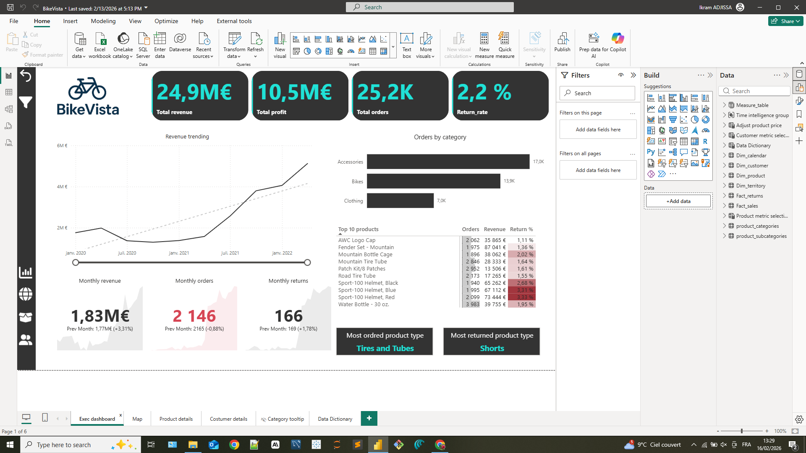
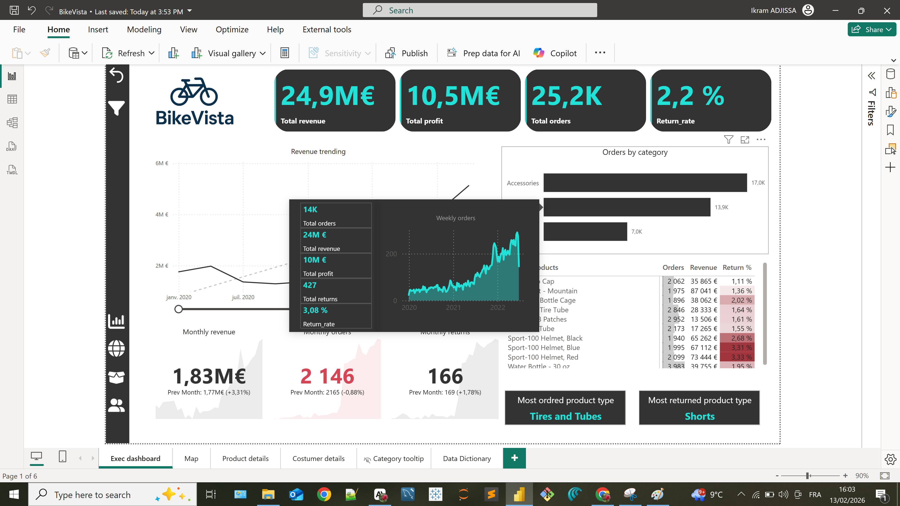
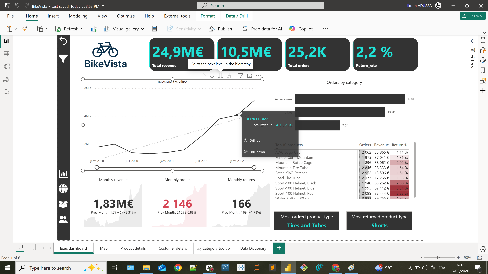
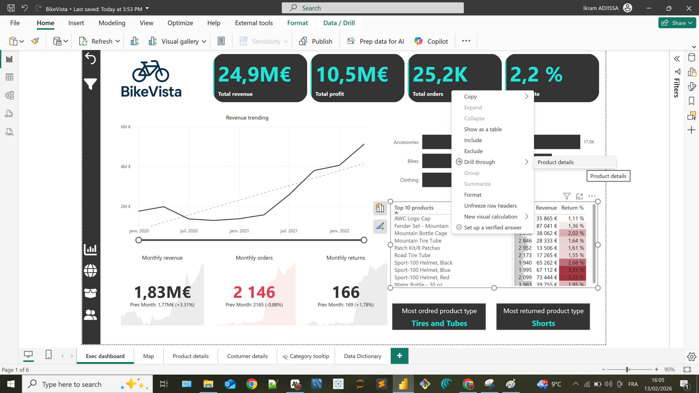
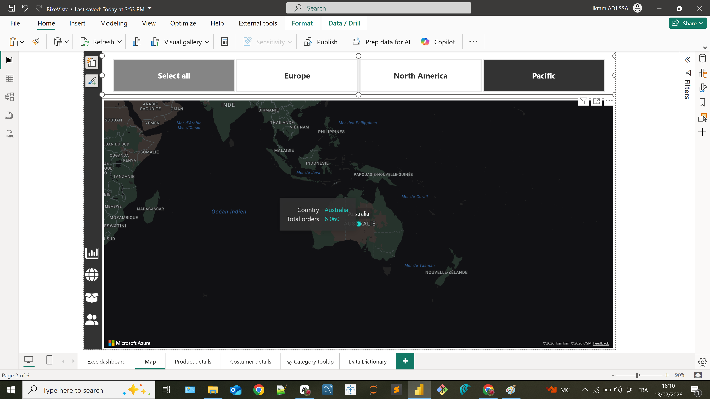
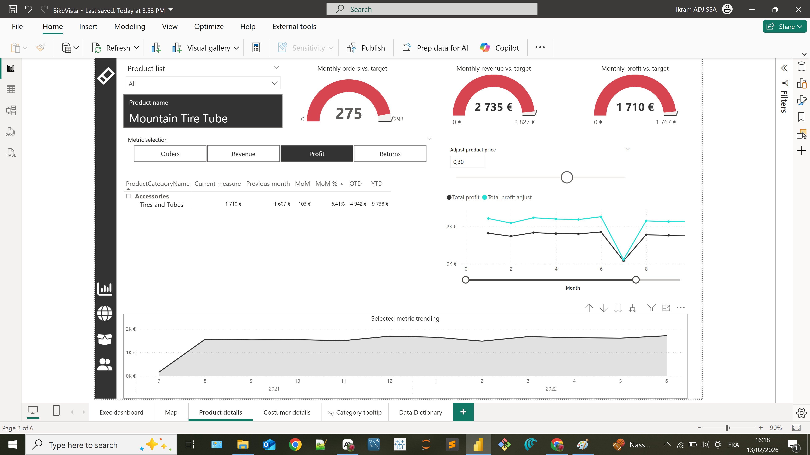
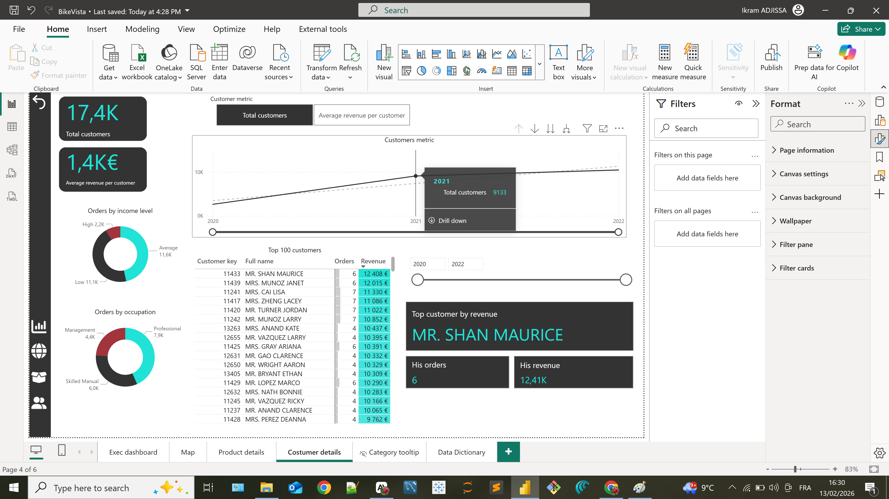

# 🚴‍♀️ BikeVista: Functional Demo & Data Storytelling

This document serves as a walkthrough of the **BikeVista** reporting solution. It demonstrates how raw data is transformed into actionable business insights through interactive features, adhering to a logical storytelling flow.

---

## 1. The Executive Dashboard: The Big Picture
**Goal:** Provide leadership with an immediate view of high-level metrics.

This is the command center. At a glance, we track:
* **Total Revenue:** €24.9M
* **Profit Margin:** A healthy €10.5M profit
* **Volume:** 25,200 orders processed
* **Quality Control:** A return rate of only 2.2%

**Key Insight:** The *Revenue Trending* chart reveals a clear upward trajectory from 2020 to 2022, signaling successful business scaling. Accessories are the leading category by volume (17k orders), while specific products like "Tires and Tubes" drive high sales.

---

## 2. Interactive Insights: Self-Service BI
Power BI is not about static numbers. We empower users to explore the "Why" behind the data.

### Custom Tooltips

Hovering over the categories bar chart details—weekly order breakdowns, revenue, and profit for that specific category. Stakeholders get answers instantly without requesting product reports.

### Drill-Down Capabilities

Using the drill hierarchy, users can move from a yearly strategic view down to monthly or weekly tactical views. For instance, drilling into **January 2022** reveals a revenue peak of **€4.06M**.

---

## 3. Seamless Navigation: Drill-Through

To maintain a clean interface while offering depth, I implemented **Drill-Through** features. By right-clicking a product (e.g., in the Top 10 list), a user navigates directly to a filtered *Product Details* page. This creates a cohesive analytical experience.

---

## 4. Geographic Analysis
**Goal:** Optimize logistics and identify growth territories.

*(Above: Map filtered on the Pacific Region)*

The map visualizes our global presence. When focusing on the **Pacific region**, we instantly identify Australia as a key market generating **6,060 orders**. This geospatial insight aids in territory planning and stock distribution.

---

## 5. Product Performance Deep-Dive
**Goal:** Analyze profitability and variance against targets.

When a specific product is selected—for example, the **Mountain Tire Tube**—the entire page adapts dynamically:
* **Orders:** 275 units (slightly under the 293 target).
* **Financials:** €1,710 profit with a 6.41% margin.
* **Trend:** The bottom chart isolates the profit trend for this specific item, helping spot seasonality.

---

## 6. Customer Intelligence
**Goal:** Understand customer lifetime value (CLV) and segmentation.

We have **17,400 customers** with a strong average revenue of **€1,400 per customer**.
* **Segmentation:** Professionals make up our largest buyer segment.
* **Top Performer:** The table highlights our VIP clients, such as **Mrs. Shan Maurice**, who generated **€12,408** in revenue.

This view is critical for designing retention strategies and loyalty programs.

---

## 7. Data Governance
Transparency is essential. A dedicated **Data Dictionary** page documents every measure and calculation logic, ensuring auditability and trust in the figures.
> **Snapshot of the Data Dictionary:**
> *Detailed documentation of all DAX measures for transparency and auditability.*
> 

---

*This walkthrough demonstrates the end-to-end user journey, from high-level KPIs to granular customer analysis.*
